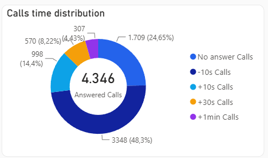
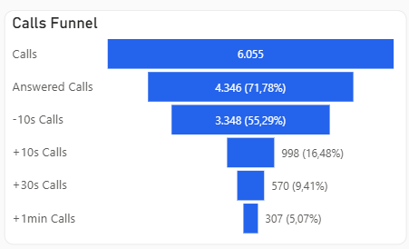

Traremos diferentes dashboards na plataformas, por isso algumas regras e KPI's precisarão ser melhores planejados

Para não ficar um código gigante para a função, podemos separar em diferentes funções da maneira que alcance o equilíbrio entre performance e facilidade de leitura/edição de código

# DASHBOARD 1 - TTPA Team Performance
Esse dashboard terá dados apenas dos representatives do TTPA
## Estrutura
### Filtros
- TTPA Representatives
- Date
- Form Name (chamar apenas de Form)

### Linha 1: Cards
- Calls
- Submissions
- Deals
- Students
- Submission Rate
- Deals Rate
- Students Rate

### Linha 2: Gráficos Seletor de KPI e histórico
- Seletor para escolher entre Submission, Calls, Deals, Students e SMS
- Horizontal Bar Chart: KPI by Date (Day, Week, Month)

### Linha 3: Gráficos by KPI
- Bar Chart: KPI by Representative
- Donut Chart: KPI by Form Name
- Donut Chart: AVG Daily KPI by Weekday
- Matrix: KPI by Hour and Weekday (strong color for biggest values)

### Linha 4: Calls Cards
- Avg Talk Time
- Calls Per Rep
- AVG Dailyu Calls
- ACG Daily Calls per Rep

### Linha 5: Gráficos Calls
- Donut Chart: Calls time Distribution

- Bar Chart: AVG Talk Time by Representative
- Funnel: Calls Funnel

- Donut Chart: Students by Representative (with Count)

### Linha 6: Submissions Cards
- Submissions Per Rep
- AVG Daily Submissions
- AVG Daily Submissions per Rep

### Linha 7: Sources
- Bar chart: Submission by source
- Bar chart: Deals by source
- Bar chart: Calls by source
- Bar chart: Students by source

### Linha 8: Deals cards
- Deals
- Students
- Deals Rate x Submissions
- Students Rate x Submissions
- Students Rate x Deals

# DASHBOARD 2 - FS Team engagmement for TTPA Leads
Esse dashboard busca entender se o FS Team está ligando para os leads enviados pelo TTPA, obs: os dados do FS Team são somente referentes a calls. Submissions, deals e students para esse caso será utilizada toda a base.

## Estrutura
### Filtros
- FS Team Representative
- Date
- Form Name

### Linha 1: Cards
- Calls
- Calls per Lead
- Leads (Submissions)
- Deals
- Students
- Leads no called (submissions)

### Linha 2: Charts
- Donut Chart: Calls time Distribution
- Calls by Date

### Linha 3: Charts
- Bar chart: Calls by Representative
- seletor: Se quer ver na tabela leads que não foram ligados, tiveram apenas 1 ligação (apenas quando não tem deal)
- Table: Leads no Called [Lead Name, Submission Date, TTPA Representative, icon to: CRM URL]
