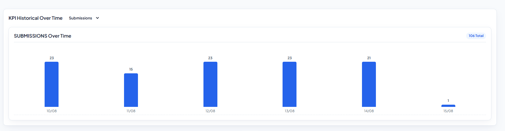
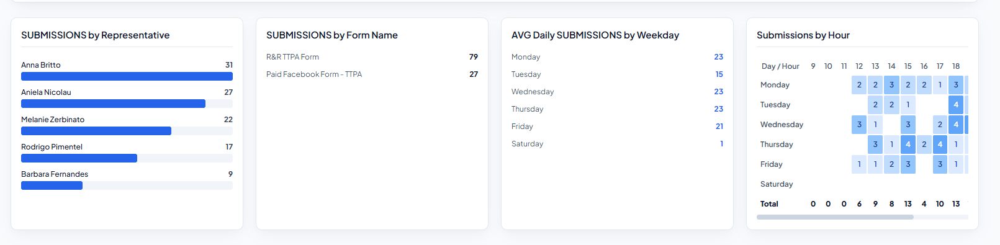
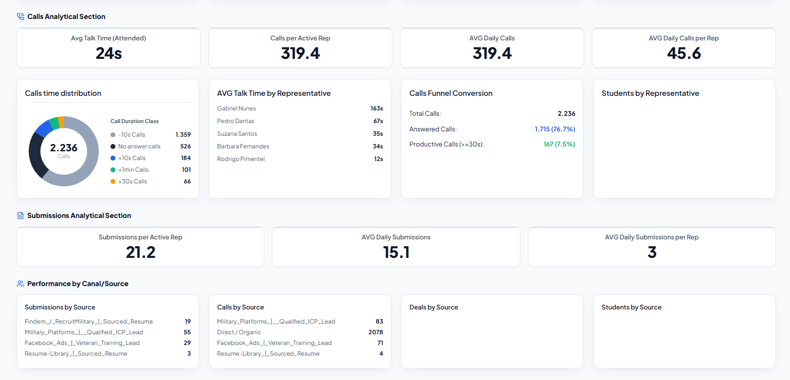
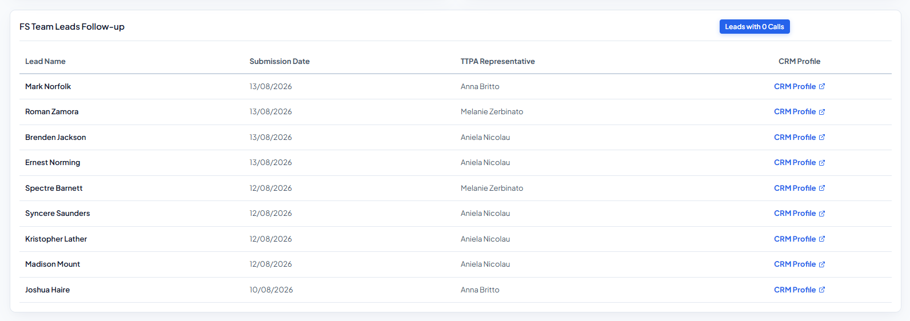
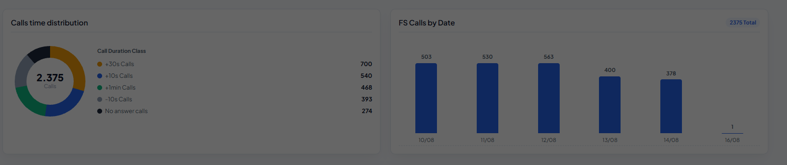

1. Crie um pop-up ao clicar em qualquer card ou gráfico que irá mostrar o detalhamento daqueles dados a nivel dContacts_crm + KPI em evidência, adicione também sempre o crm_url.
2. Adicione a opção de escolher entre dia, semana e mês nesse gráfico

3. by form name e by week day devem ser bar chart e não uma tabela, submission by hour pode ocupar mais espaço da tela, não precisa serem todos os 4 do mesmo tamanho

4. O mesmo para esses, investigue porque não tem os gráficos de students e deals, se o problema for não ter entendido o relacionamento, ele deve ser: dRepresentative > dContacts_crm > fstudents/fdeals

5. O botão de leads with 1 call (No Deal) fica em branco quando não selecionado, sendo impossível ver, ele também está aparecendo sem nenhum dado, o que acredito não ser verídico. Em relação a tabela, crie paginamento com 20 registros por página

6. Dê mais espaço para o FS Calls by Date, o donut chart não precisa de tanto espaço.
