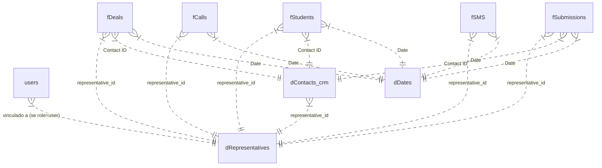

# Documentação do Banco de Dados e Modelo Semântico (TTPA Dashboard)

Este documento descreve detalhadamente a arquitetura do Data Warehouse, o modelo semântico de dados, dicionário de tabelas, regras de negócio, estratégias de chaves sintéticas (Surrogate Keys), segurança em nível de linha (RLS) e o pipeline ETL no Supabase.

---

## 1. Arquitetura Geral do Data Warehouse

O modelo adota a arquitetura **Star Schema (Esquema Estrela)** com modelagem dimensional Kimball, composto por:
* **3 Tabelas Dimensão (`dDates`, `dRepresentatives`, `dContacts_crm`)**: Fornecem o contexto analítico e relacional.
* **5 Tabelas Fato (`fCalls`, `fSMS`, `fDeals`, `fStudents`, `fSubmissions`)**: Registram eventos de negócio e métricas operacionais.
* **1 Tabela de Controle de Usuários (`users`)**: Integrada com o Supabase Auth para controle de acesso RBAC e RLS.



---

## 2. Camadas de Dados (Medallion Architecture)

| Camada | Diretório | Descrição |
| :--- | :--- | :--- |
| **Bronze (Raw)** | `raw_data/` e `data/*.csv` | Dados brutos extraídos das APIs (HubSpot CRM, Aircall, JotForm/Formstack). |
| **Silver** | `transformations/silver/` | Limpeza inicial, parsing de JSONs para CSVs e padronização primária. |
| **Gold** | `transformations/gold/` | Aplicação do modelo dimensional (Star Schema), geração de Surrogate Keys UUIDv5 determinísticas e cruzamento entre dimensões. |
| **Load (Database)** | `load/` & `run_load.py` | Carga otimizada dos CSVs da camada Gold no Supabase usando Upsert e RLS. |

---

## 3. Modelo Semântico & Regras de Negócio

### 3.1. Chaves Sintéticas Determinísticas (Surrogate Keys)
Para garantir idempotência no pipeline de carga e evitar duplicatas ao usar `UPSERT`, **não utiliza-se UUIDs aleatórios (`uuid4`)**. Todos os IDs primários são UUIDv5 determinísticos (`uuid.uuid5(uuid.NAMESPACE_OID, key)`):

* `dRepresentatives.id`: `UUIDv5(lower(Representative.strip()))`
* `fCalls.id`: `UUIDv5(call_id)`
* `fSMS.id`: `UUIDv5(datetime_customerNumber_aircallNumber)`
* `fDeals.id`: `UUIDv5(Deal ID)`
* `fStudents.id`: `UUIDv5(Deal ID)`
* `fSubmissions.id`: `UUIDv5(Submission ID)`

### 3.2. Classificação de Representantes (`dRepresentatives`)
Os representantes são categorizados na coluna `Type`:
* **`TTPA`**: Representantes pertencentes à lista oficial de representantes TTPA (`Anna Britto`, `Aniela Nicolau`, `Barbara Fernandes`, `Rafaela Porto`, `Gabriel Nunes`, `Iasmin Canhette`, `Jose Vega`, `Melanie Zerbinato`, `Pedro Dantas`, `Rodrigo Nunes`, `Rodrigo Pimentel`, `Suzana Santos`).
* **`FS Team`**: Demais representantes mapeados a partir dos dados do Aircall/CRM.

### 3.3. URL do CRM (`dContacts_crm.crm_url`)
A dimensão de contatos contém o link direto para o CRM UnifyAI:
* **Fórmula**: `https://crm.myunifyai.com/contact/edit/{Contact ID}`

### 3.4. Histórico de participação WFE (`representative_wfe_periods`)
`dRepresentatives.wfe` continua indicando se o representante integra o WFE **no momento atual**. Para o cálculo do TTPA Bonus, a participação histórica é definida por períodos em `representative_wfe_periods`.

* Cada registro contém `representative_id`, `start_date` e `end_date` opcional.
* Períodos de um mesmo representante não podem se sobrepor.
* O período é aplicado por semana do bônus: se houver interseção entre a semana e o intervalo, o representante participa do pool WFE naquela semana.
* Somente administradores podem criar, alterar ou excluir períodos; representantes conseguem ler apenas os próprios períodos para visualizar o cálculo.

### 3.5. Resolução de Full Name (`dContacts_crm`)
* Se `First Name` estiver preenchido: `First Name + " " + Last Name`.
* Se `First Name` for nulo: Extrai a parte antes de `" -"` da coluna `Name`.

---

## 4. Dicionário de Dados do Banco de Dados

### 4.1. Tabela `public.users` (Controle de Acesso)
Vinculada diretamente ao schema de autenticação `auth.users` do Supabase.

| Coluna | Tipo | Restrições | Descrição |
| :--- | :--- | :--- | :--- |
| `id` | `UUID` | `PRIMARY KEY`, `REFERENCES auth.users(id)` | ID único do usuário autenticado. |
| `role` | `TEXT` | `NOT NULL`, `CHECK ('admin', 'user')` | Perfil de acesso ao sistema. |
| `representative_id` | `UUID` | `REFERENCES dRepresentatives(id)` | ID do representante vinculado (Obrigatório para `role='user'`). |

---

### 4.2. Tabela `public."dDates"` (Dimensão Calendário)

| Coluna | Tipo | Descrição |
| :--- | :--- | :--- |
| `Date` | `DATE` | **Chave Primária**. Data no formato `YYYY-MM-DD`. |
| `Year` | `INT` | Ano (ex: `2026`). |
| `Month Number` | `INT` | Número do mês (`1` a `12`). |
| `Month Name` | `TEXT` | Nome do mês por extenso (ex: `June`). |
| `Short Month Year` | `TEXT` | Mês abreviado e ano (ex: `Jun-2026`). |
| `Month Year Sort` | `INT` | Ordenador numérico (`YYYYMM`). |
| `Quarter` | `INT` | Trimestre (`1` a `4`). |
| `Year Quarter` | `TEXT` | Formato `2026/Q2`. |
| `Year Month` | `TEXT` | Formato `2026-06`. |
| `Week of Year` | `INT` | Número da semana no ano. |
| `Year Week` | `TEXT` | Formato `2026-W25`. |
| `Year Week Sort` | `INT` | Ordenador numérico da semana. |
| `Day` | `INT` | Dia do mês (`1` a `31`). |
| `Day of Week` | `INT` | Dia da semana (`1` a `7`). |
| `Day Name` | `TEXT` | Dia da semana por extenso (ex: `Tuesday`). |
| `Week Range` | `TEXT` | Intervalo da semana (ex: `15.jun - 21.jun`). |
| `IsBusinessDay` | `BOOLEAN` | `True` se for dia útil. |
| `IsHoliday` | `BOOLEAN` | `True` se for feriado. |

---

### 4.3. Tabela `public."dRepresentatives"` (Dimensão Representantes)

| Coluna | Tipo | Descrição |
| :--- | :--- | :--- |
| `id` | `UUID` | **Chave Primária**. UUIDv5 determinístico baseado no nome. |
| `Representative` | `TEXT` | Nome completo do representante. |
| `Type` | `TEXT` | Categoria do representante (`TTPA` ou `FS Team`). |

---

### 4.4. Tabela `public.representative_wfe_periods` (Histórico WFE)

| Coluna | Tipo | Restrições | Descrição |
| :--- | :--- | :--- | :--- |
| `id` | `UUID` | **PRIMARY KEY** | Identificador do período. |
| `representative_id` | `UUID` | `NOT NULL`, `FK -> dRepresentatives(id)` | Representante participante do WFE. |
| `start_date` | `DATE` | `NOT NULL` | Primeiro dia de participação no pool WFE. |
| `end_date` | `DATE` | Nulo ou `>= start_date` | Último dia da participação; nulo significa período em andamento. |
| `created_at` | `TIMESTAMPTZ` | `NOT NULL` | Data/hora de criação do período. |

### 4.5. Tabela `public."dContacts_crm"` (Dimensão Contatos)

| Coluna | Tipo | Descrição |
| :--- | :--- | :--- |
| `Contact ID` | `TEXT` | **Chave Primária**. ID nativo do contato no CRM. |
| `Email` | `TEXT` | Endereço de e-mail do contato. |
| `Full Name` | `TEXT` | Nome completo tratado. |
| `Phone` | `TEXT` | Telefone limpo (últimos 10 dígitos). |
| `Form Name` | `TEXT` | Nome do formulário associado. |
| `representative_id` | `UUID` | `FK -> dRepresentatives(id)`. Representante responsável. |
| `crm_url` | `TEXT` | Link direto para edição do contato no CRM UnifyAI. |
| `Source` | `TEXT` | Canal de origem do contato obtido a partir de Deals, Students ou Submissões. |

---

### 4.5. Tabela `public."fCalls"` (Fato Ligações)

| Coluna | Tipo | Descrição |
| :--- | :--- | :--- |
| `id` | `UUID` | **Chave Primária**. UUIDv5 determinístico (`call id`). |
| `line` | `TEXT` | Linha telefônica utilizada no Aircall. |
| `direction` | `TEXT` | Direção da chamada (`inbound`, `outbound`). |
| `from` | `TEXT` | Número de origem. |
| `to` | `TEXT` | Número de destino. |
| `answered` | `BOOLEAN` | Indica se a ligação foi atendida. |
| `user` | `TEXT` | Usuário/Agente que realizou/atendeu a chamada. |
| `duration (total)` | `INT` | Duração total da ligação em segundos. |
| `duration (in call)` | `INT` | Duração efetiva da conversa em segundos. |
| `recording` | `TEXT` | URL da gravação de áudio. |
| `call direction - type` | `TEXT` | Tipo detalhado de direção. |
| `call start time` | `TEXT` | Datetime completo do início da chamada. |
| `call id` | `TEXT` | ID nativo da chamada na Aircall. |
| `customer number` | `TEXT` | Número de telefone do cliente. |
| `Date` | `DATE` | `FK -> dDates(Date)`. Data da ligação. |
| `Time` | `TEXT` | Hora no formato `HH:MM:SS`. |
| `Hour` | `INT` | Hora do dia (`0` a `23`). |
| `Representative` | `TEXT` | Nome do representante associado à chamada. |
| `representative_id` | `UUID` | `FK -> dRepresentatives(id)`. |

---

### 4.6. Tabela `public."fSMS"` (Fato Mensagens SMS)

| Coluna | Tipo | Descrição |
| :--- | :--- | :--- |
| `id` | `UUID` | **Chave Primária**. UUIDv5 determinístico. |
| `event` | `TEXT` | Tipo do evento de SMS. |
| `date` | `TEXT` | String de data/hora nativa. |
| `aircall number` | `TEXT` | Número Aircall de origem/destino. |
| `customer number` | `TEXT` | Número de telefone do cliente. |
| `datetime` | `TEXT` | Datetime ISO de envio/recebimento. |
| `Date` | `DATE` | `FK -> dDates(Date)`. Data do evento. |
| `Time` | `TEXT` | Hora do envio. |
| `Hour` | `INT` | Hora do dia (`0` a `23`). |
| `username` | `TEXT` | Nome do usuário Aircall. |
| `Representative` | `TEXT` | Nome do representante associado. |
| `representative_id` | `UUID` | `FK -> dRepresentatives(id)`. |

---

### 4.7. Tabelas `public."fDeals"` e `public."fStudents"` (Fatos Oportunidades & Alunos)

*(Possuem estruturas idênticas; `fStudents` contém o subconjunto de `fDeals` convertidos em matrícula).*

| Coluna | Tipo | Descrição |
| :--- | :--- | :--- |
| `id` | `UUID` | **Chave Primária**. UUIDv5 determinístico (`Deal ID`). |
| `Disposition Reason` | `TEXT` | Motivo de perda/desistência. |
| `Deal ID` | `TEXT` | ID nativo do negócio no CRM. |
| `Contact ID` | `TEXT` | `FK -> dContacts_crm(Contact ID)`. Contato associado. |
| `Created At` | `TEXT` | Timestamp de criação da oportunidade. |
| `Name` | `TEXT` | Nome da oportunidade/aluno. |
| `Email` | `TEXT` | E-mail do contato. |
| `Pipeline ID` | `TEXT` | ID do funil no CRM. |
| `Stage` | `TEXT` | Etapa atual da oportunidade no funil. |
| `Course Start Date` | `TEXT` | Data prevista de início da turma/curso. |
| `Program Enrollment` | `TEXT` | Nome do programa/curso matriculado. |
| `Source` | `TEXT` | Canal de origem do lead (Filtrado por fontes válidas). |
| `Date` | `DATE` | `FK -> dDates(Date)`. Data de criação. |
| `time` | `TEXT` | Hora da criação. |
| `Hour` | `INT` | Hora do dia (`0` a `23`). |
| `representative_id` | `UUID` | `FK -> dRepresentatives(id)`. |

---

### 4.8. Tabela `public."fSubmissions"` (Fato Formulários/Leads)

| Coluna | Tipo | Descrição |
| :--- | :--- | :--- |
| `id` | `UUID` | **Chave Primária**. UUIDv5 determinístico (`Submission ID`). |
| `Submission ID` | `TEXT` | ID nativo da submissão no formulário. |
| `Submitted At` | `TEXT` | Datetime do envio do formulário. |
| `Form ID` | `TEXT` | ID do formulário preenchido. |
| `Form Name` | `TEXT` | Nome do formulário preenchido. |
| `First Name` | `TEXT` | Primeiro nome do participante. |
| `Last Name` | `TEXT` | Sobrenome do participante. |
| `Email` | `TEXT` | E-mail preenchido. |
| `Phone` | `TEXT` | Telefone preenchido. |
| `City` | `TEXT` | Cidade. |
| `State` | `TEXT` | Estado. |
| `Lead Grade - R&R` | `TEXT` | Qualificação R&R do lead. |
| `Notes` | `TEXT` | Observações do formulário. |
| `Lead Grade` | `TEXT` | Qualificação geral do lead. |
| `First Contact Rep - RRTTPA` | `TEXT` | Representante do primeiro contato. |
| `Contact ID` | `TEXT` | `FK -> dContacts_crm(Contact ID)`. |
| `Date` | `DATE` | `FK -> dDates(Date)`. Data de envio. |
| `time` | `TEXT` | Hora de envio. |
| `Hour` | `INT` | Hora do dia (`0` a `23`). |
| `Representative` | `TEXT` | Representante atribuído após regra de fallback Aircall. |
| `representative_id` | `UUID` | `FK -> dRepresentatives(id)`. |
| `Source` | `TEXT` | Canal de origem da submissão (mapeado de `contact_ttpa_source` da Silver). |

---

## 5. Segurança & Controle de Acesso (Row Level Security - RLS)

Todas as tabelas do schema público possuem RLS habilitado (`ENABLE ROW LEVEL SECURITY`). A autorização é controlada dinamicamente via token JWT da sessão Supabase:

### 5.1. Regra de Admins (`role = 'admin'`)
* Usuários com `role='admin'` na tabela `public.users` têm acesso total de leitura (`SELECT`) a **todas as linhas e tabelas**.

### 5.2. Regra de Usuários Comuns (`role = 'user'`)
* Usuários com `role='user'` só conseguem visualizar linhas onde a coluna `representative_id` corresponda exatamente ao `representative_id` associado ao seu perfil na tabela `public.users`:
```sql
USING (representative_id = (SELECT representative_id FROM public.users WHERE users.id = auth.uid()))
```

### 5.3. Trigger de Sincronização Automática de Usuários
Sempre que uma conta de usuário é criada no Auth do Supabase (`auth.users`), a trigger PostgreSQL insere automaticamente o registro espelho em `public.users` com `role = 'user'`:
```sql
CREATE OR REPLACE FUNCTION public.handle_new_user()
RETURNS trigger AS $$
BEGIN
  INSERT INTO public.users (id, role)
  VALUES (new.id, 'user');
  RETURN new;
END;
$$ LANGUAGE plpgsql SECURITY DEFINER;
```

---

## 6. Estratégia de Carga & Execução do Pipeline (ETL)

O pipeline de dados pode ser executado através dos scripts Python na raiz do projeto:

```bash
# Executa o pipeline completo (Extract -> Transform -> Load)
python main.py

# Ou executa cada etapa individualmente:
python run_extraction.py
python run_transformations.py
python run_load.py
```

### 6.1. Comportamento de Carga em `run_load.py`
1. **Full Refresh (Delete + Re-insert)**: Aplicado exclusivamente às tabelas de fluxo dinâmico de negócios: `fSubmissions`, `fDeals` e `fStudents`.
2. **Upsert Incremental (`ignore_duplicates=True`)**: Aplicado para as tabelas fato de alto volume histórico estático (`fCalls` e `fSMS`). Dispara `ON CONFLICT DO NOTHING` no nível Postgres, garantindo baixíssima latência e prevenindo sobrecarga de gravações no banco.
3. **Upsert de Atualização (`ignore_duplicates=False`)**: Aplicado às tabelas dimensão (`dDates`, `dRepresentatives`, `dContacts_crm`) para garantir atualização contínua de atributos (como a inserção da `crm_url`).
